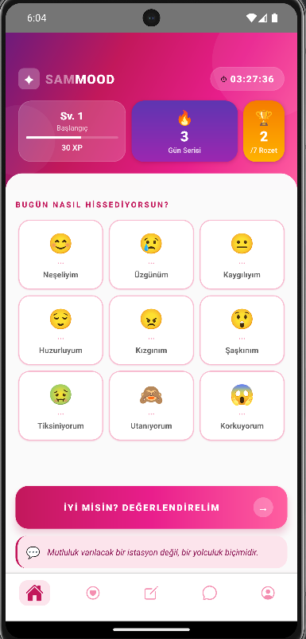
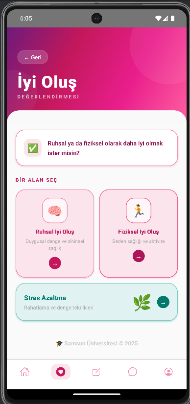
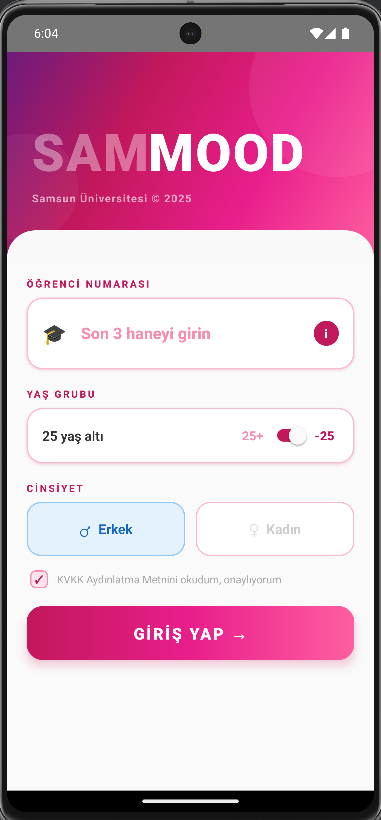

# SamMood 🧠💜

> Samsun Üniversitesi öğrencileri için geliştirilmiş, oyunlaştırma destekli ruh sağlığı ve iyi oluş takip uygulaması.


---

## 📱 Ekran Görüntüleri





---

## 📖 Proje Hakkında

SamMood, üniversite öğrencilerinin günlük ruh hallerini takip etmelerini, zihinsel sağlıklarını geliştirmelerine yardımcı olacak önerilere ulaşmalarını ve gerektiğinde güvenlik desteği almalarını sağlayan bir mobil uygulamadır.

Uygulama, motivasyonu artırmak amacıyla **oyunlaştırma (gamification)** dinamikleri içermektedir: kullanıcılar her etkileşimde XP kazanır, seviye atlar, rozet toplar ve günlük seri oluştururlar.

---

## 🎮 Oyunlaştırma Özellikleri

| Özellik | Açıklama |
|---|---|
| ⚡ **XP Sistemi** | Her ruh hali seçiminde +10 XP, rozet kazanımlarında ek XP |
| 🏆 **Seviyeler (Leveling)** | XP biriktikçe seviye atlama; her seviye farklı gradient tema rengi |
| 🎖️ **Rozetler (Badges)** | 6 farklı başarım rozeti: 3 Gün Serisi, 7 Gün Serisi, 100 XP, Sosyal, Yaratıcı, Doğa |
| 🔥 **Günlük Seri (Streak)** | Arka arkaya uygulama kullanımı seri sayacını artırır |
| 🧩 **Rozet Toast Bildirimi** | Yeni rozet kazanıldığında ekranda animasyonlu bildirim gösterilir |
| 📊 **XP İlerleme Çubuğu** | Bir sonraki seviyeye ne kadar kaldığını gösteren dinamik progress bar |

---

## ✨ Uygulama Özellikleri

- **Ana Ekran (HomeScreen):** Ruh hali seçimi (6 emoji), günlük seri ve XP takibi, motivasyon alıntısı, gerçek zamanlı kullanım sayacı
- **İyi Oluş Ekranı (RuhsalScreen):** Konuya özel renk kodlu 6 zihinsel sağlık önerisi; her karta tıklandığında makale modalı açılır
- **Profil & Güvenlik (GuvenlikScreen):** Kullanıcı profil kartı, kazanılan rozetler, KADES ve PDR destek butonları

---

## 🎥 Tanıtım Videosu

> **[▶️ YouTube'da İzle](https://www.youtube.com/watch?v=YOUTUBE_LINK_BURAYA)**

---

## 📦 APK İndirme

> **[⬇️ SamMood APK'yı İndir](./apk/app-debug.apk)**

*APK dosyasını cihazınıza yüklemek için Ayarlar > Güvenlik > Bilinmeyen Kaynaklar seçeneğini etkinleştirin.*

---

## 🚀 Kurulum ve Çalıştırma

### Gereksinimler

- Node.js >= 18
- JDK 17
- Android Studio (Android SDK 33+)
- React Native CLI

```bash
node --version   # >= 18 olmalı
java --version   # JDK 17 olmalı
```

### 1. Repoyu Klonlayın

```bash
git clone https://github.com/ipekbalkiz/sammood.git
cd sammood
```

### 2. Bağımlılıkları Yükleyin

```bash
npm install
```

### 3. Android Build Temizliği

```bash
cd android && ./gradlew clean && cd ..
```

### 4. Cihaz veya Emülatörü Başlatın

```bash
adb devices
```

### 5. Uygulamayı Çalıştırın

```bash
# Terminal 1 — Metro bundler
npx react-native start

# Terminal 2 — Android build
npx react-native run-android
```

### 6. APK Oluşturmak İçin

```bash
cd android
./gradlew assembleDebug
# APK: android/app/build/outputs/apk/debug/app-debug.apk
```

---

## 🛠️ Kullanılan Teknolojiler

| Paket | Sürüm | Kullanım |
|---|---|---|
| React Native | 0.73 | Mobil uygulama çatısı |
| react-native-linear-gradient | ^2.8 | Gradient renkler |
| React Navigation | ^6 | Ekranlar arası navigasyon |
| React Context API | — | Global state yönetimi (XP, streak, rozetler) |

---

## 📁 Proje Yapısı

```
sammood/
├── android/                   # Native Android dosyaları
├── apk/                       # İndirilebilir APK
├── screenshots/               # Ekran görüntüleri
├── src/
│   ├── context/
│   │   └── AppContext.js      # XP, streak, rozet state yönetimi
│   ├── data/
│   │   └── mockData.js        # Ruh hali verileri (MOODS)
│   └── screens/
│       ├── HomeScreen.jsx     # Ana ekran — ruh hali & gamification
│       ├── RuhsalScreen.jsx   # Zihinsel sağlık önerileri
│       └── GuvenlikScreen.jsx # Profil, rozetler, güvenlik desteği
├── App.jsx                    # Navigasyon kökü
└── package.json
```

---

## 👩‍💻 Geliştirici

| | |
|---|---|
| **Ad Soyad** | İpek Balkız |
| **Öğrenci No** | 231118087 |
| **Bölüm** | Yazılım Mühendisliği |
| **Üniversite** | Samsun Üniversitesi |
| **Yıl** | 2026 |

---

## 📄 Lisans

Bu proje MIT lisansı ile lisanslanmıştır.

---

*🎓 Samsun Üniversitesi © 2026*